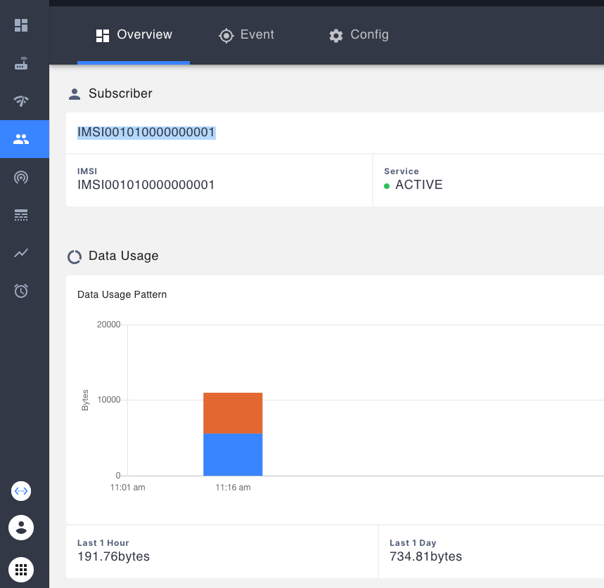

# srsRAN-demo

[](https://github.com/ShubhamTatvamasi/srsRAN-demo/actions/workflows/docker-build.yml)
[](https://hub.docker.com/r/shubhamtatvamasi/srsran-demo)
[](https://hub.docker.com/r/shubhamtatvamasi/srsran-demo)
[](https://hub.docker.com/r/shubhamtatvamasi/srsran-demo)

## Overview

This demo allows you to deploy an srsRAN installation within a Vagrant VM to send test traffic through to your Magma AGW.

```diff
- NOTE: Build fresh docker image on your system if official image is crashing for you.

docker build -t srsran .
```

**Prerequisites**

1. You already have a Magma AGW and Orchestrator running and have access to the NMS in order to make changes. This will include installing many other dependencies, some of which will be used in this demo.
2. Importantly, you will probably already have [Ansible installed](https://docs.ansible.com/ansible/latest/installation_guide/intro_installation.html)
3. And have [Vagrant installed](https://www.vagrantup.com/downloads) along [with Virtualbox](https://www.virtualbox.org/wiki/Downloads)

When finished with these, you will also need an additional Ansible dependency which you can download with:

```bash
ansible-galaxy collection install community.docker
```

After that, and assuming you still have some of the dependencies you likely downloaded when setting up your AGW, you should be ready to go.

## Preparing Magma for UE traffic in Your NMS

This assumes that you have already created and deployed the Magma AGW and Orchestrator including an organizational subdomain. Visit your NMS at something like: https://orgdomain.nms.orc8r.yourdomain.com

Then go to Traffic -> APNs -> Create New APN


Create an APN plan with an id of `default`.

Then, go to the Network tab and edit the EPC section:


In this window change the `MCC`, `MNC` and `TAC` to the following:

1. MCC -> `001`
2. MNC -> `01`
3. TAC -> `7`

Next, upload the `subscribers.csv` IMSI list in this repository to your NMS UEs under Subscriber -> Config -> Add Subscriber:


Then press the upload button, select the file, and save it afterwards:


---

## Creating a Vagrant VM

With the prerequisites done, start by creating a Vagrant VM with `vagrant up`

As a part of this process, your machine may not have the default bridge in the Vagrantfile: `bridge: "ens1f0"`

If that's the case it will prompt you to select an interface:

```
==> default: Available bridged network interfaces:
1) en0: Wi-Fi
2) en5: USB Ethernet(?)
3) awdl0
4) llw0
5) en4: Thunderbolt 4
6) en2: Thunderbolt 2
7) en3: Thunderbolt 3
8) en1: Thunderbolt 1
9) bridge0
==> default: When choosing an interface, it is usually the one that is
==> default: being used to connect to the internet.
==> default:
    default: Which interface should the network bridge to?
```

Use the `en0` interface by typing `1` and pressing enter, or by modifying the Vagrantfile with your corresponding interface in the `config.vm.network` section. For example:

```vagrantfile
    config.vm.network "private_network", bridge: "ens1f0", ip: "192.168.60.171", nic_type: "82540EM"
```

If you do change the configuraiton in the vagrantfile to support a differetnt bridge then run `vagrant reload` and continue.

**Adding Your SSH Public Key to the srsRAN Vagrant VM for Ansible**

After your Vagrant VM finishes spinning up, you'll need to add the public SSH key from your *host* machine to the srsRAN Vagrant VM so that it will trust your host when Ansible uses that key to connect to it.

Check for your public key name in your host machine:

- `ls ~/.ssh/`

It migh be something like: `id_ed25519.pub`

Then copy the contents of `id_ed25519.pub` onto your clipboard and log into the srsRAN vagrant VM with `vagrant ssh`.

Then, edit the `~/.ssh/authorized_keys` file on the *guest* srsRAN Vagrant VM and add the contents of your public key copied from the host.

# srsRAN Ansible

Now we need to configure Ansible to access your srsRAN Vagrant VM and build the srsRAN Docker images and use the correct configuration to communicate with your Magma AGW.

### Setup Ansible Variables

First, you'll need to gather a few variables from your AGW installation. Sign into your AGW instance and run the following commands to gather the relevant IP information:

1. The MME IP address from your AGW:
    ```bash
    ifconfig eth1 | grep 'inet ' | awk '{print $2}'
    ```

2. The **gtp_br0** IP of the AGW (We will use this in a later section):
    ```bash
    ifconfig gtp_br0 | grep 'inet ' | awk '{print $2}'
    ```

Then, in the `/ansible/hosts.yaml` file update the following values (if they differ from their current values):

Variables | Notes
---|---
hosts | IP of the server where we have to deploy srsRAN. If using the Vagrant VM to host srsRAN This should be: `192.168.60.171`
ansible_user | Username of server machine. This should be `"vagrant"` if using the Vagrant VM as described above.
mme_addr | MME IP of Magma's Access Gateway. This should be the IP of the eth1 interface from Magma Access Gateway obtained with the first of two `ifconfig` commands above when run in the AGW.
bind_addr | This should be your interface IP that will be used to communicate with the MME. If running the Vagrant VM as described it is likely the same `192.168.60.171` as the hosts IP.
docker_image | Depending on your processor you may have to rebuild docker image. Different architectures may require you to recompile it from within the Vagrant VM. If needed, push the new image to dockerhub and update this variable.

---

With these values edited as needed, make sure to save the `hosts.yaml` file.

### Deploy srsRAN

Now we can use Ansible to install Docker within the Vagrant VM, build the srsRAN images and then kick off a demo.

Install Docker and srsRAN on the srsRAN Vagrant VM with Ansible:

```bash
ansible-playbook install-everything.yaml
```

This should automatically start the process of connecting to your AGW with one of the UEs.

### Verify setup

To verify that the process was successful check the docker logs from inside the srsRAN Vagrant VM:

```bash
docker logs srsue -f
```

You should see something like this:

```
Opening 1 channels in RF device=zmq with args=tx_port=tcp://*:2001,rx_port=tcp://localhost:2000,id=ue,base_srate=23.04e6
Available RF device list: zmq
CHx base_srate=23.04e6
CHx id=ue
Current sample rate is 1.92 MHz with a base rate of 23.04 MHz (x12 decimation)
CH0 rx_port=tcp://localhost:2000
CH0 tx_port=tcp://*:2001
Waiting PHY to initialize ... done!
Attaching UE...
Closing stdin thread.
Current sample rate is 1.92 MHz with a base rate of 23.04 MHz (x12 decimation)
Current sample rate is 1.92 MHz with a base rate of 23.04 MHz (x12 decimation)
.
Found Cell:  Mode=FDD, PCI=1, PRB=50, Ports=1, CP=Normal, CFO=-0.2 KHz
Current sample rate is 11.52 MHz with a base rate of 23.04 MHz (x2 decimation)
Current sample rate is 11.52 MHz with a base rate of 23.04 MHz (x2 decimation)
Found PLMN:  Id=00101, TAC=7
Random Access Transmission: seq=32, tti=1781, ra-rnti=0x2
RRC Connected
Random Access Complete.     c-rnti=0x46, ta=0
Network attach successful. IP: 192.168.128.12
E
Received RRC Connection Release (releaseCause: other)
RRC IDLE
```

When you see "RRC Connected" int he logs that means you should be able to test the connection bidirectionally between the AGW and the srsRAN UE.

## Testing

For testing download: ping the **gtp_br0** network of AGW that we got earlier in `Setup Ansible Variables` when running commands to find different IPs in the AGW.

Run this from the srsRAN vagrant machine to trigger a ping to the AGW from the srsRAN UE:

```bash
docker exec -it srsue ping 192.168.128.1
```

A success should look something like this:

```console
[srsRAN-VM] vagrant@ubuntu-focal:~$ docker exec -it srsue ping 192.168.128.1
PING 192.168.128.1 (192.168.128.1) 56(84) bytes of data.
64 bytes from 192.168.128.1: icmp_seq=2 ttl=64 time=26.9 ms
64 bytes from 192.168.128.1: icmp_seq=3 ttl=64 time=35.6 ms
^C
--- 192.168.128.1 ping statistics ---
4 packets transmitted, 2 received, 50% packet loss, time 3010ms
rtt min/avg/max/mdev = 26.891/31.269/35.648/4.378 ms
```

For testing upload: Sign into the AGW and ping the Network attached IP of UE from the AGW:
```bash
ping 192.168.128.12
```

This IP above can be seen whenever you `vagrant ssh` into the srsRAN VM. It should be included within the startup messages:

```
Welcome to Ubuntu 20.04.3 LTS (GNU/Linux 5.4.0-94-generic x86_64)

...OMITTED

  Processes:    136      IPv4 address for tun_srsue: 192.168.128.12

```

If these requests work, and you see the ping results like this:

```console
[AGW] vagrant@magma-dev-focal:~$ ping 192.168.128.12
PING 192.168.128.12 (192.168.128.12) 56(84) bytes of data.
64 bytes from 192.168.128.12: icmp_seq=2 ttl=64 time=33.8 ms
64 bytes from 192.168.128.12: icmp_seq=3 ttl=64 time=29.5 ms
```

At this point, you should also should expect to start seeing Traffic recorded within the NMS:



That means this test was a success!

---

### Testing Network Performance with iperf3

As another option, you can test network performance in addition to basic connectivity with iperf3.

**Testing in the Upload direction from the UE to AGW**

First, start an iperf3 server on the AGW:

```bash
[AGW] $ iperf3 -s
```

Then, start the iperf3 test from within the srsue container on the srsRAN Vagrant VM. Change the IP address below to the AGW MME IP. This is most likely the MME IP in your `hosts.yaml` file:

```bash
docker exec -it srsue iperf3 -c 192.168.60.142 -t 20
```

The above command should run the upload test from the srsue docker container. You can stop the client at any time from the srsRAN VM and see the Bitrate and total transferred.

#### Download

You can run a test of Download speeds by starting the `iperf3` server inside the srsue docker container:

```bash
[srsRAN-VM] $ docker exec -it srsue iperf3 -s
```

And then starting the test from the AGW:

```bash
[AGW] $ iperf3 -c 192.168.128.12 -t 86400
```

The IP above is the IP of the srsue obtained earlier.

#### iperf3 loop

Start iperf3 server inside AGW:
```bash
iperf3 -s
```

run loop inside srsRAN server:
```bash
./iperf3-loop.sh
```
---

### Debug

packet capture:
```bash
# capture packets for eth1 interface
sudo tcpdump -i eth1
# capture all packets
sudo tcpdump -i any -w srs_attach.pcap
# capture packets for the MME host
sudo tcpdump host 192.168.5.92 -i any -w srs_attach.pcap
```

Ref: https://docs.srsran.com/en/latest/app_notes/source/zeromq/source/index.html
